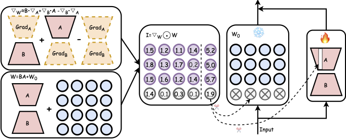

<p align="center">
 <br>
</p>


## Introduction
  
> **[LoRAPrune: Pruning Meets Low-Rank Parameter-Efficient Fine-Tuning](https://arxiv.org/abs/2305.18403)** [[arXiv]](https://arxiv.org/abs/2305.18403)
> 
> *Mingyang Zhang<sup>1,2</sup>, Hao Chen<sup>1</sup>, Chunhua Shen<sup>1,3</sup>, Zhen Yang<sup>1</sup>, Linlin 
> Ou<sup>2</sup>, Xinyi Yu<sup>2</sup>, Bohan Zhuang<sup>1</sup>*   
> *Zhejiang University<sup>1</sup>, Zhejiang University of Technology<sup>2</sup>, Ant Group<sup>3</sup>*

This repository contains code for reproducing LoRAPrune. LoRAPrune can iteratively prune LPMs in a memory-efficient manner. Specifically, LoRAPrune uses a LoRA-guided pruning criterion, which uses the weights and gradients of LoRA, rather than the gradients of pre-trained weights for importance estimation. 

<p align="center">
 <br>
</p>

#### Updates:
* June, 20, 2024: Code is released!
* May, 20, 2024: LoRAPrune is accepted by ACL 2024 Findings! 

#### TODO List:
- [ ] Support more LLMs.

## Quick Start

### Installation
```
pip install -r requirement.txt
```

### Prune LPMs
```
sh script/prune.sh
```
This script would compress the LLaMA-7B model. You need to download [LLaMA-7B](https://huggingface.co/decapoda-research/llama-7b-hf) pretrained weights. The dataset would be automatically downloaded and sampled. You also can prune more larger LPMs, e.g.,  [LLaMA-13B](https://huggingface.co/decapoda-research/llama-13b-hf), [LLaMA-30B](https://huggingface.co/decapoda-research/llama-30b-hf) and [LLaMA-65B](https://huggingface.co/decapoda-research/llama-65b-hf).
To save GPU memory, you can optionally quantize the pre-trained weights to 8 bits by adding ``` --load_in_8bit```.

### Evaluate results
```
sh script/evaluate.sh
```
After pruning, you can evalute the pruning resutls on Wixitext2 and PTB datasets.


## Citation
If you find this project useful, please cite
```
@misc{zhang2023pruning,
      title={Pruning Meets Low-Rank Parameter-Efficient Fine-Tuning}, 
      author={Mingyang Zhang and Hao Chen and Chunhua Shen and Zhen Yang and Linlin Ou and Xinyi Yu and Bohan Zhuang},
      year={2023},
      eprint={2305.18403},
      archivePrefix={arXiv},
      primaryClass={cs.LG}
}
```
